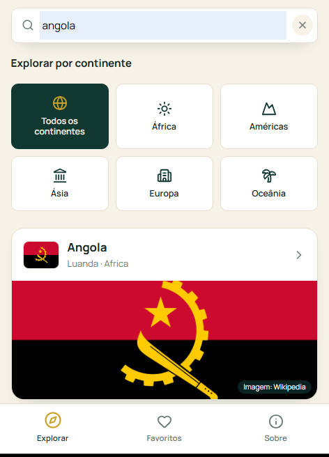
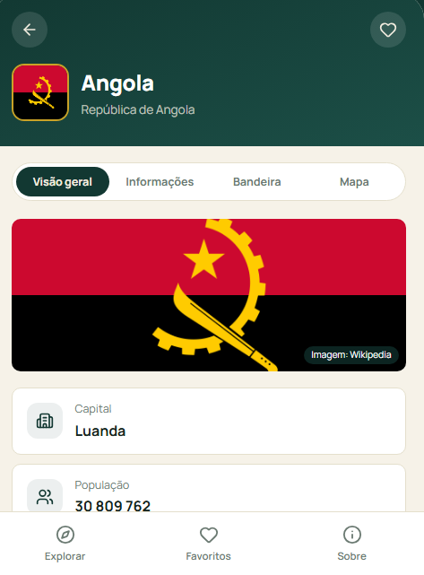

# 🌍 Explorador de Países

Um atlas interativo para explorar bandeira, capital, população e moeda
de 195 países — com pesquisa em português, favoritos, animações e
paisagens reais por país. Construído com **React + TypeScript + Vite**,
publicado no **GitHub Pages**.

**🔗 Site publicado:** https://nongoantonio.github.io/explorador-de-paises/

---

## 📸 Capturas de ecrã

<table>
  <tr>
    <td align="center" width="33%">
      <br />
      <sub>Página "Sobre"</sub>
    </td>
    <td align="center" width="33%">
      <br />
      <sub>Pesquisa dinâmica</sub>
    </td>
    <td align="center" width="33%">
      <br />
      <sub>Página de detalhe</sub>
    </td>
  </tr>
</table>

---

## ✨ Funcionalidades

- 🔎 **Pesquisa dinâmica**, a cada letra escrita, sem precisar de submeter — e funciona tanto em português ("Alemanha") como em inglês ("Germany"), ignorando acentos e maiúsculas
- 🌎 **Filtro por continente**, com azulejos ilustrados
- 🖼️ **Paisagem real do país** em destaque na pesquisa e na página de detalhe, obtida ao vivo da API da Wikipedia
- ❤️ **Favoritos** persistidos no `localStorage` do browser (sem conta, sem servidor)
- 📑 **Página de detalhe por país**, com separadores: Visão geral, Informações, Bandeira e Mapa
- 🎞️ **Animações** em toda a interface (Framer Motion): entradas, transições de página e de separador, feedback tátil nos botões
- 📱 **Desenhado como app móvel**, com barra de navegação inferior e totalmente responsivo
- 🌐 **Publicado automaticamente** no GitHub Pages a cada `push`, via GitHub Actions

---

## 🛠️ Tecnologias

| Categoria         | Tecnologia                                                                 |
| ------------------ | --------------------------------------------------------------------------- |
| Interface           | [React 19](https://react.dev/) + [TypeScript](https://www.typescriptlang.org/) |
| Build               | [Vite](https://vite.dev/)                                                    |
| Navegação           | [React Router](https://reactrouter.com/) (`HashRouter`)                     |
| Animações           | [Framer Motion](https://motion.dev/)                                        |
| Ícones              | [lucide-react](https://lucide.dev/) + [react-icons](https://react-icons.github.io/react-icons/) |
| Bandeiras           | [flagcdn.com](https://flagcdn.com) — gratuito, sem chave de API             |
| Paisagens dos países | [Wikipedia API](https://www.mediawiki.org/wiki/API:Main_page) — gratuito, sem chave |
| Publicação          | GitHub Actions → GitHub Pages                                               |

---

## 📦 Como correr o projeto localmente

```bash
git clone https://github.com/nongoantonio/explorador-de-paises.git
cd explorador-de-paises
npm install
npm run dev
```

Abre `http://localhost:5173` no browser.

| Comando           | O que faz                                               |
| ------------------ | -------------------------------------------------------- |
| `npm run dev`       | servidor de desenvolvimento com hot reload               |
| `npm run build`     | compila TypeScript e gera a versão de produção em `dist/` |
| `npm run preview`   | serve localmente a versão de produção já compilada       |

---

## 🚀 Publicação (GitHub Pages)

O deploy é **automático**: o workflow `.github/workflows/deploy.yml`
compila e publica o site sempre que há um `push` para `main`.

Detalhes técnicos relevantes, para quem quiser adaptar este projeto:

- **`base` no `vite.config.ts`** aponta para `/explorador-de-paises/`,
  porque o GitHub Pages publica o site numa subpasta, não na raiz do domínio.
- **`HashRouter`** em vez de `BrowserRouter` (em `src/main.tsx`), porque
  o GitHub Pages não tem servidor a redirecionar rotas — evita erro 404
  ao recarregar páginas internas como `/pais/AGO`.
- Ficheiros estáticos (`countries.json`, favicons, foto de perfil) são
  pedidos com `import.meta.env.BASE_URL` à frente, para respeitarem a
  subpasta em produção.

---

## 🧠 De onde vêm os dados

A primeira versão deste projeto usava a REST Countries API diretamente
do browser. Esse serviço tornou-se entretanto um produto pago com
contas e chaves de API. Por isso, os dados de cada país (nome, capital,
região, população, moeda) são servidos como um **ficheiro estático
próprio** (`public/countries.json`), gerado por
`scripts/build-country-data.cjs` a partir de datasets abertos —
continuando a ser pedidos com `fetch()`, tal como a qualquer API.

As **bandeiras** vêm do [flagcdn.com](https://flagcdn.com) e as
**paisagens** vêm da [Wikipedia](https://www.wikipedia.org) — ambos
serviços gratuitos, ao vivo, sem necessidade de conta.

---

## 📂 Estrutura do projeto

```
.github/workflows/deploy.yml  # build + deploy automático para o GitHub Pages
src/
├── components/     # peças de UI reutilizáveis (uma responsabilidade cada)
├── context/        # CountriesContext (dados) e FavoritesContext (localStorage)
├── hooks/          # useCountryFilter, useCountryImage
├── lib/            # countriesRepository, flags, wikipedia, normalizeSearchText
├── pages/          # ExplorePage, FavoritesPage, AboutPage, CountryDetailPage
├── types/country.ts
scripts/build-country-data.cjs  # gera public/countries.json
public/countries.json           # dados dos 195 países
```

---

## 🗺️ Próximos passos

- [ ] Mostrar os países vizinhos na página de detalhe como cartões clicáveis
- [ ] Tema claro/escuro
- [ ] Ordenar a lista por população
- [ ] Cotação de moeda ao vivo (ex.: [frankfurter.app](https://frankfurter.app))

---

## 👤 Autor

**Nongo António**
Software Engineer · Web Developer · UI/UX Designer

[](https://github.com/nongoantonio)
[](https://www.linkedin.com/in/nongo-ant%C3%B3nio-9691603a3/)

> I believe in continuous learning and constantly strive to grow by
> exploring new technologies, tools, and best practices — building
> solutions that solve real problems and add value to people and
> organizations.
